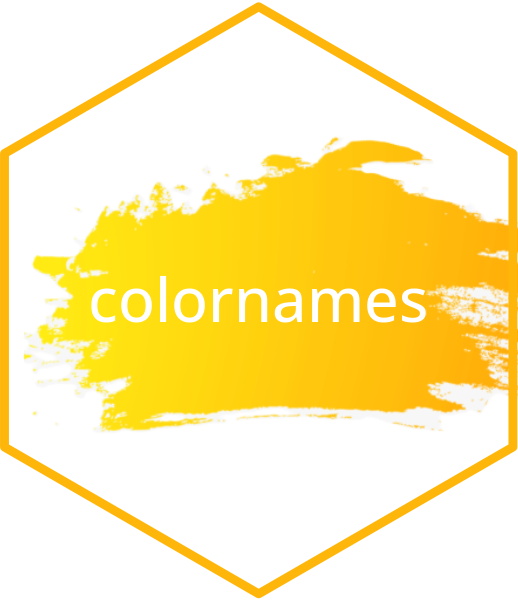

<!-- README.md is generated from README.Rmd. Please edit that file -->

<!-- badges: start -->
[](https://CRAN.R-project.org/package=colornames)
[](https://github.com/lgnbhl/colornames/actions/workflows/R-CMD-check.yaml)
[](https://www.linkedin.com/in/FelixLuginbuhl)
<!-- badges: end -->

# colornames 

```{r, include = FALSE}
knitr::opts_chunk$set(
  collapse = TRUE,
  warning = FALSE,
  message = FALSE
)
```

> Convert Color Values into Color Names

The **colornames** R package aims to convert color values into color names using various APIs:

- *[www.thecolorapi.com](https://www.thecolorapi.com)*: pass in any valid color and get conversion into any other format, the name of the color, placeholder images and a multitude of schemes.

- *[colornames.org](https://colornames.org)*: a collaborative effort to name every color in the RGB/web space. You can [name a random color](https://colornames.org/random/) or vote from some [incoming color names](https://colornames.org/fresh/).

- *[color.pizza](https://github.com/meodai/color-name-api)*: Rest API that returns a bunch of color names for a given color-value.


## Installation

```{r eval=FALSE}
install.packages("colornames")

#install.packages("devtools")
devtools::install_github("lgnbhl/colornames") # from GitHub
```

## Minimal examples

```{r}
library(colornames)
```

Color name using thecolorapi's API.

```{r}
get_color_thecolorapi(hex = "#0047AB")
```

Color name using colornames's API.

```{r}
get_color_colornames(hex = "#0047AB")
```

Color name using color.pizza's API.

```{r}
get_color_colorpizza(hex = "#0047AB")
```


## thecolorapi.com API

Call `get_color_thecolorapi()` to get the closest color name available of a hex code.

```{r}
get_color_thecolorapi(hex = "#0047AB")
```

The "thecolorapi.com" API return a list of variables about a given color name, by using `return_name_only = FALSE`.

```{r}
col1 <- get_color_thecolorapi(hex = "#0047AB", return_name_only = FALSE)

str(col1, max.level = 1)
```

You can create a data.frame from this list.

```{r}
as.data.frame(col1[1:9])
```

You can get color names from different color convention, i.e. `rgb`, `hsl` or `cmyk`.

```{r}
get_color_thecolorapi(rgb = paste(3,60,71, sep = ","))
get_color_thecolorapi(hsl = paste("100","100%","34%", sep = ","))
get_color_thecolorapi(cmyk = paste(50,58,0,33, sep = ","))
```


You can get color names from an existing list of colors using the closest named hex available.

```{r}
library(scales)
library(purrr)

pal_hue <- scales::brewer_pal()(6)

pal_names <- purrr::map_chr(.x = pal_hue, .f = get_color_thecolorapi)

data.frame(
  hex = pal_hue,
  name = pal_names
)
```

You can also get a color scheme (color palette) from any color.

```{r}
pal <- get_color_thecolorapi_scheme(
  hex = "0047AB", 
  count = 5, 
  mode = "monochrome", 
  return_name_only = FALSE)

#get closed color name available
# data.frame(
#   hex = pal$colors$hex$value,
#   name = pal$colors$name$value
# )

pal$colors$hex
```

**Note that when an invalid color name is used, the API return "#000000" (black color).**

```{r}
get_color_thecolorapi(hex = "InvalidColorReturnsBlack")
```


## colornames.org API

```{r}
get_color_colornames(hex = "3D290C")
```

The function `get_color_colornames()` can also return a dataframe using `return_name_only = FALSE`.

**Note that the API returns hex codes as pure numbers, without a starting hashtag “\#”**

```{r}
df <- get_color_colornames(hex = "3D290C", return_name_only = FALSE)
#add "#" back in beginning of each hex code
df$hexCode <- paste0("#", df$hexCode)
df
```

Hex codes should **always** have 6 characters:

```{r, eval=FALSE}
get_color_colornames(hex = "440154FF")
```

    # Error: Hex code 440154FF has 8 characters. 
    # Hex code should have 6 characters.

You an also get an random color name:

```{r}
get_color_colornames_random(return_name_only = FALSE)
```

You can explore the latest 100 submissions:

```{r}
latest_100 <- get_color_colornames_latest(return_name_only = FALSE)

head(latest_100)
```

You can loop to get color names of a given palette:

```{r}
library(scales)
library(purrr)

pal_hue <- scales::brewer_pal()(6)
pal_names <- purrr::map_chr(.x = pal_hue, .f = get_color_colornames)

data.frame(
  hex = pal_hue,
  name = pal_names
)
```

If color names are missing (like above), you can choose to [give them a name](https://colornames.org/random/).

If for some reason you want to use this color names database into
production, you should be aware that the color names are potentially
changing as [anyone can vote](https://colornames.org/fresh/) anytime to change any color name. Therefore you should download a copy of the colornames database at a given time.

You can download the complete data and use it locally.

```{r, eval=FALSE}
url_data <- "https://colornames.org/download/colornames.zip"
your_file_path <- paste0(getwd(), "/colornames-", Sys.Date(), ".zip")
download.file(url = url_data, destfile = your_file_path)
colornames_df <- readr::read_csv(your_file_path)

# Joke with hex codes 00000 to 00003
colornames_df
```
    
    # # A tibble: 3,157,757 × 3
    #    hex bestName                     votes
    #    <chr>   <chr>                        <dbl>
    #  1 000000  Dude Turn The Lights Back On  5351
    #  2 000001  It's Still Basically Black     729
    #  3 000002  Still Black                    121
    #  4 000003  So Close To Black It Hurts     145
    #  5 000004  Blackerererer                   27
    #  6 000005  Jet Black Heart                 16
    #  7 000006  Abaddon                         16
    #  8 000007  Double O Seven                  56
    #  9 000008  Closed Eyes                     26
    # 10 000009  Really Dark Blue                29
    # # ℹ 3,157,747 more rows

This [downloadable data](https://colornames.org/download/) is totally free of rights, under [CC0
1.0](https://creativecommons.org/publicdomain/zero/1.0/).

## color.pizza API

The color.pizza database is more stable as it is modified only by its core contributors.

You can get the name of of the closest color name with `get_color_colorpizza()`.

```{r}
get_color_colorpizza(hex = "#3D290C")
```

You can access different information about a given color using `return_name_only = FALSE`.

```{r}
get_color_colorpizza(hex = "#3D290C", return_name_only = FALSE)
```

You can get the color names from a unique source with "list" argument and avoid duplicated colors with "noduplicates".

```{r}
get_color_colorpizza(
  hex = c("#3D290C","#1c2f11","#2e3f24"),
  list = "wikipedia",
  noduplicates = TRUE,
  return_name_only = FALSE)
```

You can get color names from an existing list of colors using the closest named hex available.

```{r}
library(purrr)
library(scales)

pal_hue <- scales::brewer_pal()(6)
pal_hue_names <- get_color_colorpizza(hex = pal_hue)

data.frame(
  hex = pal_hue,
  name = pal_hue_names
)
```
